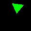
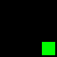
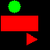
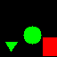
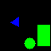
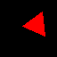
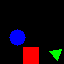
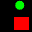
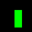

# Easy VQA Counting with Keras

## Introduction

This project is motivated by the tendency for visual question answering (VQA) models to struggle with counting questions. [This blog post](https://blog.einstein.ai/interpretable-counting-for-visual-question-answering/) introduces the problem and proposes several specialized counting modules as a solution. Another goal is to provide a small, simple dataset for quick experimentation. Our code is based on [easy-VQA-keras](https://github.com/vzhou842/easy-VQA-keras), but adapted for counting.

We hope this code will provide a starting point to investigate more challenging counting problems.

### What is the task about?
The main goal of VQA is to take an image (feature maps) and a question (text embedding) to get a single answer (one or few words). In its simplest implementation, e.g. using [easy-VQA-keras](https://github.com/vzhou842/easy-VQA-keras), VQA models take a single feature map of the image and a single text embedding of the question to perform a fusion between them and produce an answer.

However, some models as [TallyQA](https://arxiv.org/abs/1810.12440) and [Interpretable Counting for Visual Question Answering](https://blog.einstein.ai/interpretable-counting-for-visual-question-answering/) use features maps obtained from the predictions of object detectors, i.e. these models use the predicted bounding boxes. This project is based on the approach of object detection because we found that this approach is more related to counting.

### Quick insight about our method

Our method has the following components:

- a question embedding which is just a simple Bag of Words (BoW) of the question. This is a simple approach but enough for counting questions which will be pretty similar.
- a few embeddings from the bounding boxes. For simplicity, we still do not have the object detector right now, but we have the bounding boxes since we generate the dataset we know were are the objects. We take every bounding box and create a feature map for every one present in the image. For example, in the next figure we have only three bounding boxes, so we have three feature maps in the rest of the model.
- a fusion scheme which can be an element-wise sum, concatenation, or multiplication  as explained in [Fusion Techniques](https://www.sciencedirect.com/science/article/pii/S1566253518308893). 
- An additional option is to use element-wise multiplication along with Gated Tanh Units [(GTU)](https://arxiv.org/abs/1707.07998). This GTUs are meant to learn non-linear transformations within the network. These GTUs have shown a strong empirical advantage over traditional ReLU or tanh layers alone. When dealing with small datasets (e.g. 300 images for training), GTUs have shown to speed up the convergence and performance.

<p align="center">
    
</p>

Our method takes the question embedding (BoW) and the feature maps bounding boxes in the image, performs a fusion (we have implemented element-wise operation), then combines all the resulting features maps to finally perform a prediction using a softmax layer.

## Install the following libraries

- tensorflow
- opencv

## Usage

- first, `python dataset_gen.py` to generate data.
- `python train.py data_dir model_name (additional args)` to train a model.
- command line arguments after model_name are passed to the model and specific to the chosen model
- to run with the default data: `python train.py data/five count`

Currently supported model names and arguments (positional arguments):

- `easy_vqa`: optional arg `--big-model` to add more convolutional layers
- `count`: optional arg `concat`, `add_n`, `mul_n` to change the fusion method from the Gated Tanh Unit default method. Default is recommended. If using `add_n` or `mul_n`, include an additional integer argument equal to the size of the image and question embedding to be fused. 

Example 1:
```python
python train.py data/box_test_v3 count add_n 32
```
- This line uses the dataset located in <em>data/box_test_v3</em>, using the <em>count</em> model, the <em>add_n</em> as the fusion method, and the feature maps in the fusion has a size of <em>32</em>.

Example 2:
```python
python train.py data/box_test_v3 count 64
```
- This line uses the dataset located in <em>data/box_test_v3</em>, using the <em>count</em> model, since there is no fusion method explicitly indicated it will use the Gated Tanh Units, and the feature maps in the fusion has a size of <em>64</em>.

## Generating Data

Our dataset consists of small images with varying numbers of shapes, which can be 3 kinds of shape (circle, triangle, square) and 3 colors (red, green, blue). Questions are simply the names of the category to count, for example "triangle" for "how many triangles?", "red square" for "how many red squares?", or "any" for "how many shapes total?". Answers are a number, but the numbers are written as words in case we also want to add other kinds of answers in the future.

Let's head to `dataset_gen.py` and walk through generating your first dataset. First, you'll see a series of parameters to edit.
- `dataset_name = "five"`: choose a name for your dataset. A folder data/<dataset_name> will be created for your data.
- `max_shape_count = 5`: the maximum number of shapes to appear per image in this dataset. Each image will have a random number of shapes from 1 to max_shape_count.
- `color_questions = True, shape_questions = True`: whether color and/or shape questions will be included in the dataset. For a simpler task, set only one of these to true. For example, if only color_questions is true, all questions will be "red", "green", or "blue" to count the number of shapes with that color, regardless of shape.
- `n_train_images = 8000, n_test_images = 1000`: the number of train and test images. Note that the dataset will contain multiple questions per image. There should be at least a few thousand train images to ensure sufficient generalization.
- `img_size = 64`: the size in pixels of the square images. For 5 or fewer shapes, 64 should be enough. With more, the image will start to get crowded (an image will only add shapes until no more can fit) and size should be increased.
- `min_shape_size = 15`: the minimum size in pixels of the bounding box of each shape in the image.
- `allow_overlap = False`: whether shapes are allowed to overlap in the image. Setting this to True would make the VQA task more difficult.
- `balance_factor = math.ceil(max_shape_count / 2.0)` the ratio of the most common answer to the least common answer. Initally, every possible question is generated, which will create many more questions with low numbers than high numbers, and incentivize the model to answer a low number all the time. Balance_factor sets a maximum ratio of one answer to another and discards excess questions, so, for example, with max_shape_count = 5, there will be 3 "zero" questions for every "five" question.
- `include_boxes = True`: whether the bounding boxes of the form (x0, y0, x1, y1, shape class) for each shape are saved or not. Should usually be set to True.
- `noisy_boxes = False`: if True, adds noise to the bounding boxes by randomly adjusting the edges. This can simulate VQA with an imperfect object detector.

Once you've chosen your parameters, simply run `python dataset_gen.py` to generate the data.

### Example Images













### Code to generate a new dataset (dataset_gen.py)

```python
#Parameters to be modified
dataset_name = "five"
color_questions = True
shape_questions = True
n_train_images = 8000
n_test_images = 1000
max_shape_count = 5
img_size = 64
min_shape_size = 15
allow_overlap = False
balance_factor = 3 #ratio of the most common answer to the least common answer
include_boxes = True

#Code that generates the questions
train_questions, train_images, train_names, train_annotations = generate_data(n_train_images)
test_questions, test_images, test_names, test_annotations = generate_data(n_test_images)
```

## Preprocessing the Data

`prepare_data.py` loads the data you just generated into a form the neural network can understand. You won't need to run this file directly but you should understand how it works. The setup function returns everything you will need:

- `train_X_ims`: an image for each question. An array of shape (num_questions * img_size * img_size * 3). Num_questions = the size of the dataset.
- `train_X_seqs`: the questions in bag-of-words format. For example, if the vocabulary is `["circle", "triangle", "rectangle", "red", "green", "blue", "any"]`, then the question "red circle" would be `[1, 0, 0, 1, 0, 0, 0]`. Total shape: (num_questions * vocab_size). Note that bag-of-words only works for this dataset because the order of words in the question doesn't matter.
- `train_box_features`: for each question, an array of small images representing the contents of the bounding box for each object in the image, resized to a standard size. Total shape: (num_questions * MAX_COUNT * BOX_SIZE * BOX_SIZE * 3). `MAX_COUNT` is the maximum number of shapes per image that your model can handle. If the image contains fewer shapes, excess boxes will be zeros. `BOX_SIZE` is the (square) size to which all bounding box contents are resized for input to the model. Both of these values are set in `constants.py`.
- `train_box_classes`: if you want a simpler model that only cares about the label of each bounding box, not the constants, use this. In this project, class = shape and the classes are onehot encoded, so for example, `[1, 0, 0]` is "circle". For color information, you will need to look at the actual image. Total shape: (num_questions * MAX_COUNT * 3)
- `train_Y`: the onehot encoded answers, of shape (num_questions * num_answers)
- (Repeat these vectors for the test data)
- `vocab_size`: the number of possible words in the question
- `num_answers`: the number of possible answers (will be from 0 to max_shape_count)
- Any other values returned are not currently used.

If you're training a new model and want to include additional inputs such as the coordinates of the bounding boxes, you can find them in this function and add them to the returned values. You can change the formatting of bounding boxes by writing a new function similar to `format_box_features`.

## Training a Model

We include two example models, `easy_vqa_model` and `count_model`. You can create your own models following the format of these models. Every model must implement two functions:

- `build_model(im_shape, vocab_size, num_answers, args)`: creates the Keras model with the given image shape, vocabulary size, and number of answers, which will be returned by `prepare_data.py`. These, along with the constants BOX_SIZE and MAX_COUNT, are needed to determine the input and output sizes of the model. Args is a list of strings which can optionally customize the model.

The `easy_vqa_model` is a baseline, not expected to work well on counting. It takes the entire image and the question as inputs, extracts features from each separately, then merges the image and question features to produce a final answer. This architecture worked fine for the original non-counting `easy_vqa`, but it struggles to count beyond one. Evidently, the convolutional layers can detect whether a feature is present or not, but cannot keep track of multiple objects separately. This failure demonstrates the need for specialized counting networks.

The `count_model`, instead of using the full image, uses a list of small images representing the contents of each bounding box. `img_model` is a repeated module for each box image, which takes the image and the question as an input, extracts features from the image, and outputs a score of whether that box should be counted for that question. The scores for each box are then summed, and the sum is converted to a onehot-encoded answer. This model performs much better than the last on counting, showing the importance of detecting individual objects. Note that this model is similar to SoftCount in the literature and shares the same weaknesses: it can't detect relationships between objects, and can't handle multiple bounding boxes over the same object (this object would be counted multiple times).

- `arrange_inputs(images, questions, boxes, box_classes)`: takes all of the possible inputs returned by `prepare_data.py` and returns a list of the inputs actually needed for your model. For example, `easy_vqa_model` needs `[images, questions]`, and `count_model` needs a sequence of boxes (note how the dimensions are rearranged) followed by the questions.

When creating your own model, create a new file and import it to `train.py` in the same manner as these two models.

To train a count_model on the default dataset you just generated, run `python train.py data/five count`. The model will train for 100 epochs, but you can of course change this number. WARNING: sometimes a bad random number generation will cause the model not to learn anything at all, or to experience a sudden drop in accuracy. If accuracy doesn't improve at all after several epochs, terminate the program and try again. Accuracy should steadily improve and eventually reach 1.0 if you have 5 or fewer shapes.

## Fusion methods

As indicated in [Fusion Techniques](https://www.sciencedirect.com/science/article/pii/S1566253518308893), element-wise operations can be used to perform the fusion. We performed the following operations:
- Addition (slowest method to converge).
- Concatenation.
- Multiplication (fastest method to converge).

In addition, when we combined any of the previous method with the Gated Tanh Units the performance and convergence were improved. 
Therefore, we use gated tanh as the default fusion method and recommend you do the same.

To experiment with other fusion methods, add one of the following command line arguments when using the `count` model:
- "concat"
- "add_32"
- "mul_32"

Details are in the class count_model.py. You can define your own method in this class.

## Example Experiment: Effects of Noise

This experiment tests whether we can break the `count_model` with imperfect bounding boxes, as will be found in more realistic data. Here are the test accuracy results and approximate convergence times for various max counts, with and without random noise added to the bounding box coordinates (see `dataset_gen.py` for details).

- Max count 5, no noise: 1.0, 10 epochs
- Max count 5, noise: .97, 36 epochs
- Max count 7, no noise: 1.0, 11 epochs
- Max count 7, noise: .96, 40 epochs
- Max count 10, no noise: 1.0, 12 epochs
- Max count 10, noise: .93, 45 epochs

To replicate this experiment, you would need to run `dataset_gen.py` six times, with 8000 training images,`max_shape_count` (5, 7, 10), `img_size` (64, 72, 80) respectively, and `noisy_boxes` True and False for each count. Also, MAX_COUNT in `constants.py` should be set to the chosen `max_shape_count` for each training run. 

These results show a weakness of the `count_model`: imperfect bounding boxes cause accuracy to go down and training times to increase. A likely explanation is that these conditions increase the complexity of training a model to detect objects and count the detected objects at the same time. The noisy bounding boxes may also contain pieces of neighboring objects. Most VQA literature uses a pre-trained object detector, and this is likely necessary for more challenging datasets.

## Code Locations

- `train.py` trains a new model
- `easy_vqa_model.py` and `count_model.py` contain our models. See the instructions in `train.py` to add your own model.
- `prepare_data.py` loads the dataset
- `dataset_gen.py` generates a shape counting dataset. choose parameters at the top of the file.
- `constants.py` contains color and shape constants
- `image_gen.py` creates colored shape images

## Project 
- See the dataset folder for our format
```
project
│   README.md
│   train.py 
|   etc
│
└───data
│   │
│   └───simple_images
│       │   answers.txt
│       │  
│       └───questions
│       │   test_questions.json
|       |   train_questions.json
│       │  
|       └───train
|       |   _annotations.txt
|       |   _classes.txt
|       |   img1.png
|       |   img2.png
|       |   ...
│       │  
|       └───valid
|       |   _annotations.txt
|       |   _classes.txt
|       |   img7.png
|       |   img8.png
|       |   ...
│   
```
